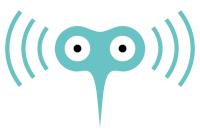

#  MoSQITo

## Background

Sound quality (SQ) metrics are developed by acoustic engineers and
researchers to provide an objective assessment of the pleasantness of a
sound. Different metrics exist depending on the nature of the sound to
be tested. Some of these metrics are already standardized, while some
others rely on scientific articles and are still under active
development. The calculation of some sound quality metrics are included
in major commercial acoustic and vibration measurement and analysis
software. However, some of the proposed metrics results from in-house
implementation and can be dependent from one system to another. Some
implementations may also lack of complete documentation and validation
on publicly available standardized sound samples. Several
implementations of SQ metrics in different languages can been found
online, confirming the interest of the engineering and scientific
community, but they often use Matlab signal processing commercial
toolbox.

## Objectives

The objective of MoSQITo is therefore to provide a unified and modular
development framework of key sound quality metrics with open-source
object-oriented technologies, favoring reproducible science and
efficient shared scripting among engineers, teachers and researchers
community.

It is written in Python, one of the most popular free programming
language in the scientific computing community. It is meant to be highly
documented (use of Jupyter notebooks, tutorials) and validated with
reference sound samples and scientific publications.

## Origin of the project

[EOMYS ENGINEERING] (www.eomys.com) initiated this open-source project 
in 2020 for the study of electric motor sound quality. The project is now
backed by [Green Forge Coop](https://www.linkedin.com/company/greenforgecoop/) non profit organization, 
who also supports the development of [Pyleecan](https://www.pyleecan.org) electrical 
machine simulation software.

## Documentation

Tutorials are available in the [tutorials](./tutorials/) folder. Documentation 
and validation of the MoSQITo functions are available in the [documentation](./documentation/) folder.

## Scope

The scope of the project is to implement the following first set of
metrics:

|| Reference | Available | Under dev. | To do |
|:-|:-|:-:|:-:|:-:|
|Loudness for steady signals (Zwicker method) | ISO 532B:1975 DIN 45631:1991 ISO 532-1:2017 §5 | x |||
|Loudness for non-stationary (Zwicker method) | DIN 45631/A1:2010 ISO 532-1:2017 §6 | x |||
| Roughness | Daniel and Weber, 1997 | x |||
| Fluctuation Strength | To be defined || x ||
| Sharpness | DIN 45692:2009 || x ||
| Tonality (Hearing model) | ECMA-74:2019 annex G || x ||

As a second priority, the project could address the following metrics:

|| Reference | Available | Under dev. | To do |
|:-|:-|:-:|:-:|:-:|
|Loudness for steady signals (Moore/Glasberg method) | ISO 532-2:2017 |||x|
|Loudness for non-stationary (Moore/Glasberg method) | Moore, 2014 |||x|
|Sharpness (using  Moore/Glasberg loudness) | Hales-Swift and Gee, 2017 |||x|
|Tone-to-noise ratio / Prominence   ratio (occupational noise, discrete tones) | ECMA-74:2019 annex D ISO 7719:2018 ||x||
|Tone-to-noise ratio (environmental noise, automatic tone detection) | DIN 45681 |||x|
|Tone-to-noise ratio (environmental noise) | ISO 1996-2 |||x|
|Tone-to-noise ratio (environmental noise) | ANSI S1.13:2005 |||x|

In parallel, tools for signal listening and manipulation will be
developed. The objective is to be able to apply some modification to a
signal (filtering, tone removal, etc.) and assess the impact on
different SQ metrics.

Of course, any other sound quality related implementation by anyone who
wants to contribute is welcome.

## Contact

You can contact us on Github by opening an issue (to request a feature,
ask a question or report a bug).

## References

Daniel, P., and Weber, R. (1997). “Psychoacoustical Roughness: Implementation 
of an Optimized Model”, Acta Acustica, Vol. 83: 113-123

Hales Swift, S., and Gee, K. L. (2017). “Extending sharpness calculation
for an alternative loudness metric input,” J. Acoust. Soc. Am.142,
EL549. 

Moore, B. C. J. (2014). “Development and Current Status of the
“Cambridge” Loudness Models,” Trends in Hearing, vol. 18: 1-29
